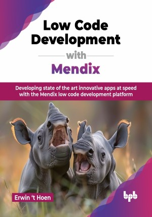

# Low Code Development with Mendix

Developing state of the art innovative apps at speed with the Mendix low code development platform.

This is the repository for [Low Code Development with Mendix
](https://bpbonline.com/products/low-code-development-with-mendix?variant=44233625960648),published by BPB Publications.

## About the Book
This book offers a comprehensive overview of the Mendix platform from a developer's perspective. This powerful technology breaks down barriers, allowing anyone, with or without coding experience, to build custom applications quickly and efficiently with a solid foundation for platform evaluation. 

Key topics include Mendix's database design, page designer, and visual tools for creating functionality through microflows and nanoflows. You will also learn about security, best practices, and automated performance enhancements. Integration with other applications via REST, SOAP, and OData is explored, as well as the creation of web, progressive, and native mobile apps, all using the same low-code approach.

By the end, you will be ready to begin your Mendix certification journey. You will have a thorough understanding of Mendix and through hands-on exercises. You will gain practical experience by developing a cloud-deployed Mendix application, positioning you for success in the fast-evolving low-code development landscape.

## What You Will Learn
• Grasp the essentials of low-code development and discover how it speeds up application creation.

• Build robust data models that mirror real-world structures for effective data representation.

• Create intuitive and reusable user-friendly interfaces using Mendix’s drag-and-drop tools, enhancing user experience.

• To automate business processes with microflows, including complex decision-making and data manipulation.

• To integrate Mendix applications with external systems using REST, SOAP, and OData APIs.

• Advanced topics like security, integration, and mobile development.
